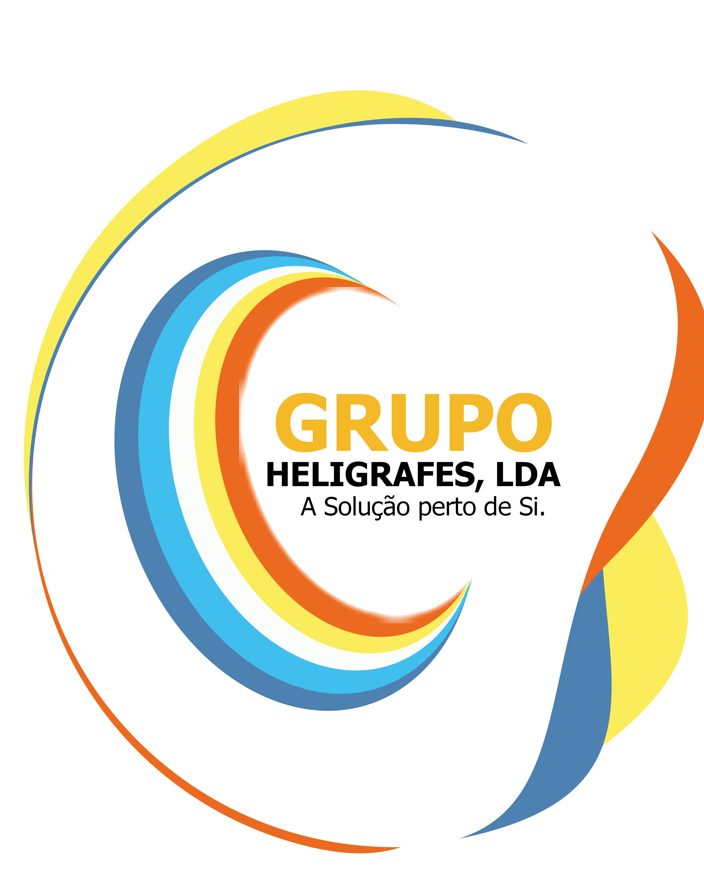

# 🎨 INTEGRAÇÃO DO LOGO GRUPO HELIGRAFES - REDESIGN VISUAL v53

## 1. ANÁLISE DO LOGO ATUAL

### Identidade Visual
- **Cores Principais**: Amarelo (#F9BD17), Azul (#063B8F / #1FAEE5), Laranja (#F36D16)
- **Estilo**: Moderno, concêntrico, dinâmico
- **Forma**: Espiral/círculos sobrepostos com movimento
- **Mensagem**: "A Solução perto de Si" - proximidade e confiança

---

## 2. MELHORIA DE ASPECTO - ESTRATÉGIA VISUAL

### 2.1 Paleta de Cores Refinada
```javascript
// Atualizar :root colors
:root {
    --heli-primary: #063B8F;      // Azul profundo (principal)
    --heli-secondary: #1FAEE5;    // Azul claro (destaque)
    --heli-accent: #F9BD17;       // Amarelo (ênfase)
    --heli-accent-alt: #F36D16;   // Laranja (alerta/ação)
    --heli-success: #10B981;      // Verde (confirmação)
    --heli-danger: #EF4444;       // Vermelho (erro)
    --heli-neutral-50: #F9FAFB;   // Branco quase puro
    --heli-neutral-900: #111827;  // Preto quase puro
}
```

### 2.2 Elementos de Branding Principais

#### A) Logo no Sidebar (Topo)
- **Local**: ``
- **Tamanho Atual**: 82px de altura
- **Melhoria**: Adicionar animação de "pulse" sutil + efeito de brilho
- **Espaço**: Aumentar para 100px com padding melhorado

#### B) Cabeçalho Executivo
- **Atual**: Apenas texto "GRUPO HELIGRAFES, LDA - Painel de Controlo"
- **Proposta**: Logo SVG + texto + badge de versão (v53)
- **Efeito**: Gradiente azul com sombra

#### C) Rodapé/Status Bar
- **Adicionar**: Mini logo + data/hora + status de sincronização
- **Visual**: Barra translúcida com ícones de status

---

## 3. ESTRUTURA DE IMPLEMENTAÇÃO

### 3.1 Arquivo de Estilos Novo
```css
/* BRANDING & LOGO STYLES */

.heli-logo-container {
    position: relative;
    display: flex;
    align-items: center;
    gap: 12px;
    padding: 8px 12px;
    border-radius: 12px;
    background: linear-gradient(135deg, 
        rgba(6, 59, 143, 0.1) 0%, 
        rgba(31, 174, 229, 0.05) 100%);
    border: 1px solid rgba(31, 174, 229, 0.2);
}

.heli-logo-icon {
    width: 48px;
    height: 48px;
    background: url('logo-grupo-heligrafes.jpg') center/contain no-repeat;
    animation: heli-logo-pulse 3s ease-in-out infinite;
}

@keyframes heli-logo-pulse {
    0%, 100% { filter: brightness(1); }
    50% { filter: brightness(1.1); }
}

.heli-brand-text {
    display: flex;
    flex-direction: column;
    gap: 2px;
}

.heli-brand-text .company-name {
    font-weight: 900;
    font-size: 14px;
    background: linear-gradient(90deg, #063B8F, #F9BD17);
    -webkit-background-clip: text;
    -webkit-text-fill-color: transparent;
    letter-spacing: 0.5px;
}

.heli-brand-text .tagline {
    font-size: 11px;
    color: #1FAEE5;
    font-weight: 700;
    letter-spacing: 0.3px;
}

.heli-version-badge {
    display: inline-block;
    background: #F36D16;
    color: white;
    padding: 2px 6px;
    border-radius: 6px;
    font-size: 9px;
    font-weight: 800;
    letter-spacing: 1px;
}
```

### 3.2 Integração no HTML

#### Header Atualizado
```html
<!-- NOVO HEADER COM LOGO -->
<header class="app-topbar h-auto px-10 py-4 flex items-center justify-between no-print z-10 backdrop-blur-sm">
    
    <!-- Seção Esquerda: Logo + Marca -->
    <div class="flex items-center gap-8">
        <div class="heli-logo-container">
            <div class="heli-logo-icon"></div>
            <div class="heli-brand-text">
                <span class="company-name">GRUPO HELIGRAFES</span>
                <span class="tagline">A Solução Perto de Si</span>
            </div>
            <span class="heli-version-badge">v53</span>
        </div>
        
        <!-- Relógio (mantém existente) -->
        <div class="clock-control" aria-label="Relógio do sistema">
            <!-- ... conteúdo existente ... -->
        </div>
    </div>
    
    <!-- Seção Centro: Informações da Sessão -->
    <div class="topbar-session flex items-center gap-6">
        <!-- ... conteúdo existente ... -->
    </div>
</header>
```

---

## 4. MUDANÇAS POR MÓDULO

### 4.1 MÓDULO DE VENDAS (TABACARIA/POS)

#### Antes:
```
PONTO DE VENDA (POS) | 🖨️ 📱 💌
```

#### Depois:
```
┌─────────────────────────────────────────┐
│ 🎯 PONTO DE VENDA (POS)                 │
│    Gestão de Venda Rápida & Caixa      │
│    [LOGO MINI] LOCAL 1 | VENDEDOR: João │
└─────────────────────────────────────────┘
```

**Código de Implementação:**
```html
<div class="pos-heading flex flex-col gap-3">
    <div class="flex items-center justify-between">
        <div class="flex items-center gap-3">
            
            <div>
                <h2 class="text-2xl font-black text-slate-800">PONTO DE VENDA (POS)</h2>
                <p class="text-sm text-slate-500 font-medium">Gestão de Venda Rápida & Controlo de Caixa</p>
            </div>
        </div>
        <div class="flex gap-2">
            <!-- botões existentes -->
        </div>
    </div>
    
    <!-- Info da Sessão -->
    <div class="bg-gradient-to-r from-blue-50 to-cyan-50 border border-blue-100 rounded-lg p-3 flex gap-4">
        <div class="text-xs">
            <span class="font-bold text-blue-600">LOCAL:</span>
            <span id="pos-location" class="font-black text-blue-800">LOCAL 1</span>
        </div>
        <div class="text-xs">
            <span class="font-bold text-blue-600">VENDEDOR:</span>
            <span id="pos-seller" class="font-black text-blue-800">João Silva</span>
        </div>
        <div class="text-xs">
            <span class="font-bold text-blue-600">TOTAL HOJE:</span>
            <span id="pos-daily-total" class="font-black text-emerald-600">0 Kz</span>
        </div>
    </div>
</div>
```

### 4.2 MÓDULO GESTÃO DE PRODUTOS

**Cabeçalho com Branding:**
```html
<div class="mb-6 flex flex-wrap items-center justify-between gap-4 rounded-3xl 
            border border-blue-100 bg-gradient-to-r from-white via-blue-50 to-cyan-50 p-6 shadow-sm">
    
    <div class="flex items-center gap-4">
        
        <div>
            <p class="text-[10px] font-black uppercase tracking-[0.18em] text-blue-600">Acesso administrativo</p>
            <h2 class="text-2xl font-black tracking-tight text-slate-800">Gestão & Venda de Produtos</h2>
            <p class="mt-1 text-sm font-medium text-slate-500">Desempenho acumulado, produtos mais vendidos e reposição prioritária.</p>
        </div>
    </div>
    
    <div class="flex gap-2">
        <!-- Botões de ação -->
    </div>
</div>
```

### 4.3 MÓDULO DE STOCKS

**Painel Principal com Identidade:**
```html
<div class="glass-panel p-6 bg-gradient-to-br from-blue-900 via-blue-800 to-blue-900 
            text-white shadow-2xl border border-blue-700">
    
    <div class="flex items-center gap-4 mb-6">
        
        <div>
            <h2 class="text-3xl font-black">GESTÃO DE STOCKS</h2>
            <p class="text-blue-200 text-sm font-bold">Sistema integrado de inventário e controlo de caixa</p>
        </div>
    </div>
    
    <!-- Conteúdo existente -->
</div>
```

### 4.4 MÓDULO RH & SALÁRIOS

**Seção de Colaboradores:**
```html
<div class="bg-gradient-to-r from-slate-800 to-slate-900 text-white rounded-2xl p-6 mb-6 shadow-lg">
    <div class="flex items-center justify-between">
        <div class="flex items-center gap-4">
            
            <div>
                <h2 class="text-2xl font-black">👥 RH & Salários</h2>
                <p class="text-slate-300 text-sm">Cadastro, ponto, faltas e processamento mensal da equipa.</p>
            </div>
        </div>
        <span class="bg-yellow-400 text-slate-900 px-4 py-2 rounded-lg font-black text-sm">GRUPO HELIGRAFES</span>
    </div>
</div>
```

### 4.5 MÓDULO RELATÓRIOS

**Dashboard com Branding:**
```html
<div class="mb-6 flex items-center justify-between gap-4 rounded-2xl bg-gradient-to-r 
            from-slate-900 via-slate-800 to-slate-900 p-6 text-white shadow-lg">
    
    <div class="flex items-center gap-4">
        
        <div>
            <h2 class="text-3xl font-black">RELATÓRIOS DE GESTÃO</h2>
            <p class="text-slate-300 text-sm mt-1">Análise de entradas, despesas e dívidas pendentes</p>
        </div>
    </div>
    
    <button onclick="renderReports()" class="bg-yellow-400 hover:bg-yellow-500 text-slate-900 
                                            px-6 py-3 rounded-xl font-black shadow-lg transition-all">
        🔄 ATUALIZAR
    </button>
</div>
```

### 4.6 MÓDULO IMPRESSÃO

**Cabeçalho Impressão com Logo:**
```html
<div class="glass-panel p-6 shadow-lg flex flex-col gap-4 border-l-4 border-yellow-400">
    <div class="flex items-center justify-between">
        <div class="flex items-center gap-4">
            
            <div>
                <h3 class="text-2xl font-black text-slate-800 flex items-center gap-2">🖨️ ÁREA DE IMPRESSÃO</h3>
                <p class="text-xs text-slate-500 font-bold">Relatórios, faturas e documentos</p>
            </div>
        </div>
        <span class="bg-yellow-100 text-yellow-700 px-3 py-1 rounded-lg text-xs font-black">HELIGRAFES v53</span>
    </div>
</div>
```

---

## 5. FAVICON E ÍCONES

### 5.1 Favicon Dinâmico
```html
<!-- Adicionar no <head> -->
<link rel="icon" type="image/svg+xml" href="data:image/svg+xml,
<svg xmlns='http://www.w3.org/2000/svg' viewBox='0 0 100 100'>
  <circle cx='50' cy='50' r='45' fill='%23063B8F'/>
  <circle cx='50' cy='50' r='35' fill='%231FAEE5' opacity='0.7'/>
  <circle cx='50' cy='50' r='25' fill='%23F9BD17' opacity='0.7'/>
  <text x='50' y='55' font-size='40' font-weight='bold' fill='%23063B8F' text-anchor='middle' font-family='Arial'>H</text>
</svg>">
```

### 5.2 Ícones de Status com Cores Heligrafes
```css
/* Status indicators */
.status-online { background: #10B981; /* Verde */ }
.status-away { background: #F9BD17; /* Amarelo */ }
.status-busy { background: #F36D16; /* Laranja */ }
.status-offline { background: #9CA3AF; /* Cinza */ }

/* Pulse animations */
.pulse-primary { animation: pulse-primary 2s ease-in-out infinite; }
@keyframes pulse-primary {
    0%, 100% { box-shadow: 0 0 0 0 rgba(6, 59, 143, 0.7); }
    70% { box-shadow: 0 0 0 10px rgba(6, 59, 143, 0); }
}
```

---

## 6. ANIMAÇÕES E TRANSIÇÕES

### 6.1 Entrada de Módulos com Logo
```css
@keyframes module-enter-heli {
    0% {
        opacity: 0;
        transform: translateY(20px) scale(0.95);
    }
    50% {
        filter: brightness(1.1);
    }
    100% {
        opacity: 1;
        transform: translateY(0) scale(1);
    }
}

.module-header {
    animation: module-enter-heli 0.6s ease-out;
}
```

### 6.2 Hover Effects em Cards com Branding
```css
.heli-card:hover {
    transform: translateY(-4px);
    box-shadow: 0 12px 24px rgba(6, 59, 143, 0.15);
    border-color: #1FAEE5;
}

.heli-card {
    transition: all 0.3s cubic-bezier(0.4, 0, 0.2, 1);
}
```

---

## 7. LAYOUT SIDEBAR ATUALIZADO

### Antes:
```
[LOGO]
Gestão integrada

🎓 Trabalho Académico
👕 T-Shirts & Brindes
⚡ VENDA DIÁRIA
```

### Depois:
```
╔═══════════════════════╗
║   [LOGO MAIOR]        ║
║ GRUPO HELIGRAFES      ║
║ A Solução Perto Si    ║
║  v53 | Premium        ║
╚═══════════════════════╝

───────────────────────
 DEPARTAMENTOS HELIGRAFES
───────────────────────

🎓 Trabalho Académico
👕 T-Shirts & Brindes
⚡ VENDA DIÁRIA
📦 Papelaria & Deco

───────────────────────
 ADMINISTRAÇÃO
───────────────────────

🛍️ Gestão Produtos
🖨️ Área de Impressão
👥 RH & Salários
🏭 Gestão de Stocks
💬 Chat Interno
📈 Relatórios
📊 Histórico & Backup

───────────────────────
🟢 SISTEMA SEGURO v53
───────────────────────
```

**Código CSS Atualizado:**
```css
.app-sidebar {
    background: linear-gradient(180deg, #042a68 0%, #063b8f 48%, #092f70 100%);
    border-image: linear-gradient(180deg, #1FAEE5, #F9BD17) 1;
}

.app-brand {
    margin: 20px 16px 12px;
    padding: 16px;
    border: 2px solid rgba(31, 174, 229, 0.3);
    background: rgba(31, 174, 229, 0.1);
    border-radius: 16px;
    box-shadow: 0 8px 16px rgba(6, 59, 143, 0.2);
}

.app-brand-logo {
    height: 100px; /* Aumentado de 82px */
    padding: 8px;
    border-radius: 12px;
    background: linear-gradient(135deg, #fff 0%, #eaf6ff 100%);
    box-shadow: 0 12px 24px rgba(6, 59, 143, 0.2);
    animation: heli-logo-pulse 3s ease-in-out infinite;
}

.app-brand > p {
    margin-top: 8px;
    font-size: 11px;
    background: linear-gradient(90deg, #1FAEE5, #F9BD17);
    -webkit-background-clip: text;
    -webkit-text-fill-color: transparent;
    letter-spacing: 1px;
}
```

---

## 8. RODAPÉ COM STATUS

### Novo Elemento
```html
<!-- Adicionar antes do </main> -->
<footer class="fixed bottom-0 left-0 right-0 z-30 no-print">
    <div class="bg-gradient-to-r from-slate-900 via-slate-800 to-slate-900 
                text-white px-6 py-2 flex items-center justify-between text-xs border-t border-slate-700">
        
        <div class="flex items-center gap-3">
            
            <span class="font-black">Grupo Heligrafes, LDA</span>
            <span class="text-slate-400">|</span>
            <span class="text-slate-400" id="footer-time">00:00</span>
        </div>
        
        <div class="flex items-center gap-4">
            <div class="flex items-center gap-2">
                <span id="sync-status" class="inline-block w-2 h-2 bg-emerald-500 rounded-full animate-pulse"></span>
                <span id="sync-text" class="text-slate-400">Sincronizado</span>
            </div>
            <span class="text-slate-400">v53</span>
        </div>
    </div>
</footer>
```

---

## 9. PLAN DE IMPLEMENTAÇÃO

| Fase | Tarefa | Prioridade | Tempo |
|------|--------|-----------|-------|
| 1 | Criar arquivo CSS novo com estilos Heligrafes | 🔴 Alta | 1h |
| 2 | Atualizar Header com logo + branding | 🔴 Alta | 1h |
| 3 | Integrar logo em 6 módulos principais | 🔴 Alta | 2h |
| 4 | Adicionar animações e hover effects | 🟡 Média | 1h |
| 5 | Atualizar Sidebar com novo layout | 🟡 Média | 1.5h |
| 6 | Criar Favicon dinâmico | 🟢 Baixa | 30min |
| 7 | Adicionar Rodapé com Status | 🟡 Média | 45min |
| 8 | Testes responsivos (mobile/tablet) | 🔴 Alta | 1h |
| **TOTAL** | | | **8.75h** |

---

## 10. FICHEIROS A CRIAR/ATUALIZAR

### 10.1 Novos Ficheiros
- `css/heligrafes-branding.css` - Estilos completos do branding
- `assets/logo-optimized.svg` - Logo em SVG otimizado
- `assets/favicon.svg` - Favicon dinâmico

### 10.2 Ficheiros a Atualizar
- `index.html` - Header, módulos, rodapé
- Sem mudanças no JavaScript (integração pura CSS/HTML)

---

## 11. CHECKLIST DE IMPLEMENTAÇÃO

- [ ] Logo aparece corretamente em todos os módulos
- [ ] Animações funcionam sem lag (60fps)
- [ ] Cores seguem identidade Heligrafes (#063B8F, #1FAEE5, #F9BD17, #F36D16)
- [ ] Responsivo em mobile (logo reduz tamanho)
- [ ] Favicon renderiza corretamente
- [ ] Status bar no rodapé atualiza em tempo real
- [ ] Sem conflitos CSS com estilos existentes
- [ ] Print funciona sem mostrar logo duplicado
- [ ] Performance não degradada (<1s mais no carregamento)

---

## 12. EXEMPLO FINAL DO VISUAL

```
┏━━━━━━━━━━━━━━━━━━━━━━━━━━━━━━━━━━━━━━━━━━━━━━━━━━━━━━━━━━━━┓
┃ [LOGO] GRUPO HELIGRAFES | 12:34:56 | v53      LOCAL 1 | João ┃
┗━━━━━━━━━━━━━━━━━━━━━━━━━━━━━━━━━━━━━━━━━━━━━━━━━━━━━━━━━━━━┛

┌─────────────────────┐   ┌────────────────────────────────────┐
│  [LOGO]             │   │ 🎯 PONTO DE VENDA (POS)           │
│ GRUPO HELIGRAFES    │   │ Gestão de Venda Rápida & Caixa    │
│ A Solução Perto Si  │   │                                    │
│                     │   │ 🖨️ 📱 💌 Relatórios              │
│ ═════════════════   │   └────────────────────────────────────┘
│ 🎓 Académico        │   
│ 👕 T-Shirts         │   ┌────────────────────────────────────┐
│ ⚡ VENDA DIÁRIA     │   │ Produtos | Qtd | Preço | Total   │
│ 📦 Papelaria        │   │ ────────────────────────────────────│
│ 🛍️ Gestão Prod.     │   │ Caneta    │ 2  │ 500  │  1000 Kz  │
│ 🖨️ Impressão        │   │ Papel A4  │ 1  │ 2500 │  2500 Kz  │
│ 👥 RH               │   └────────────────────────────────────┘
│ 🏭 Stocks           │
│                     │   Total: 3500 Kz | Método: Dinheiro
│ 🟢 SEGURO v53       │   [FINALIZAR VENDA]
└─────────────────────┘

┗━━━━━━━━━━━━━━━━━━━━━━━━━━━━━━━━━━━━━━━━━━━━━━━━━━━━━━━━━━━━┛
  [LOGO] Grupo Heligrafes, LDA | 12:34 | 🟢 Sincronizado | v53
┗━━━━━━━━━━━━━━━━━━━━━━━━━━━━━━━━━━━━━━━━━━━━━━━━━━━━━━━━━━━━┛
```

---

## 13. PRÓXIMOS PASSOS

1. **Criar `css/heligrafes-branding.css`** com todos os estilos
2. **Atualizar `index.html`** - header, módulos, rodapé
3. **Adicionar logo em formatos otimizados** (SVG + JPG)
4. **Testar em todos os navegadores** (Chrome, Firefox, Safari, Edge)
5. **Verificar performance** com DevTools
6. **Fazer commit**: `git commit -m "feat: New Heligrafes branding design v53"`

---

**Documento preparado para implementação imediata!** 🚀
